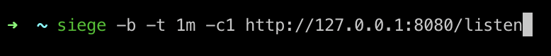
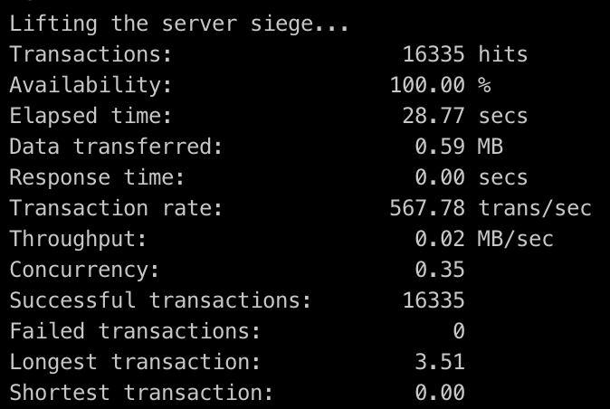
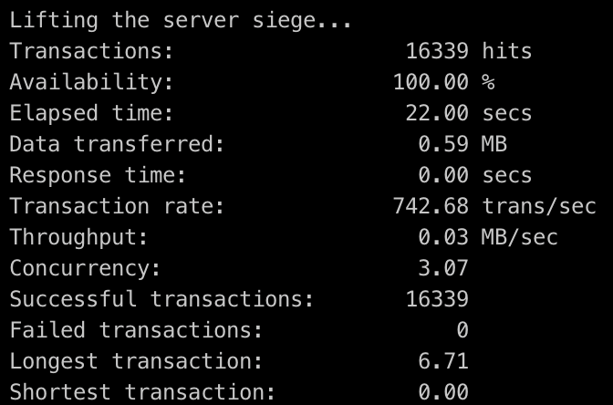

# Тестовое задание

## Тестирование
С помощью siege провел нагрузочное тестирование

1. C одним клиентом

Результат:

2. С 20 клиентами

Результат:

Как можно увидеть на протяжении всего теста доступность http-endpoint была 100%

